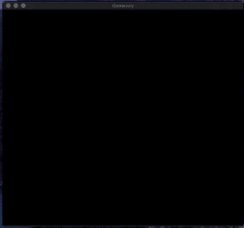

# Gameboy emulator

This is my attempt to build a Gameboy Classic emulator in Go.

## Current state

## Current goal: boot

I want to see the Nintendo logo coming down the screen and
playing the famous sound at the end.

- [x] MMU memory controller with different kind of memories
- [x] CPU with the minimum instuction set
- [x] PPU with the minimum set of features (no tests yet)
  - [x] enable/disable display
  - [x] fetcher + fifo
  - [x] background color palette
  - [x] vertical scrolling
- [x] Display
- [x] APU with min set of features (no tests)
- [x] Synchronize CPU, PPU and APU
